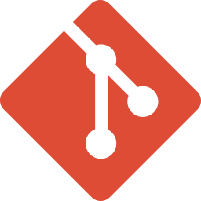

# Hi, I'm Blaze Shomida 👋

I'm a Front-end Developer based in Hawaii, transitioning from a career in sales to web development. I'm passionate about building performant and accessible web applications.

## 🛠️ Technologies & Tools

### Front-end

  

    
    
React

  

  

    
    
NextJS

  

  

    
    
Vite

  

  

    
    
SolidJS

  

  

   
   
Astro

  

  

    
    
Tailwind CSS

  

### Version Control

  

   
  
Git

  

  

   
  
GitHub

  

### Other Tools

  

    
    
Framer Motion

  

