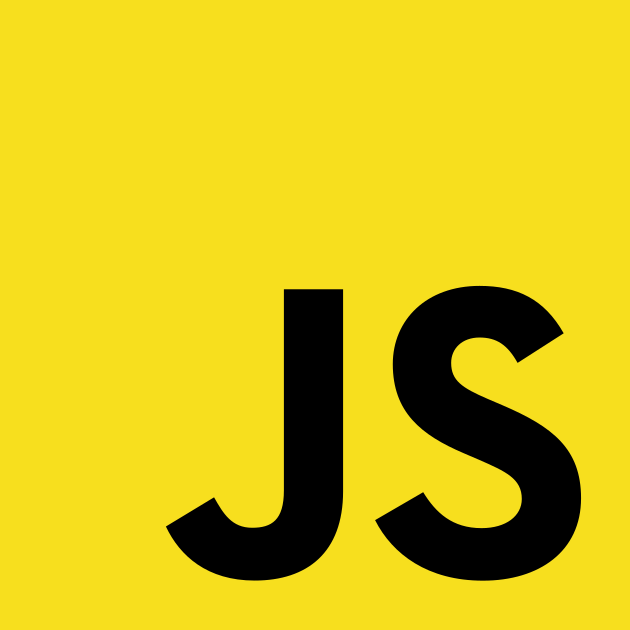

# Hey I'm Blaze 👋🏻

## About Me

I'm a self-taught software engineer specializing in performant, scalable web development. With expertise in TypeScript, Rust, React, SolidJS, and Next.js, I build clean, maintainable applications while optimizing performance. Recently, I’ve been focusing on developing libraries and tooling to enhance workflows and improve developer experience. My background in sales and mentorship strengthens my problem-solving and communication skills, enabling me to create intuitive, user-centric solutions. I’m always learning, exploring new patterns, and refining my approach to modern web development.

## 🛠️ Technologies & Tools

### Languages

  
  
  
  
  

### Front-end Frameworks

  
  
  
  
  

### Version Control

  
  

### Other Tools

 
  
  

